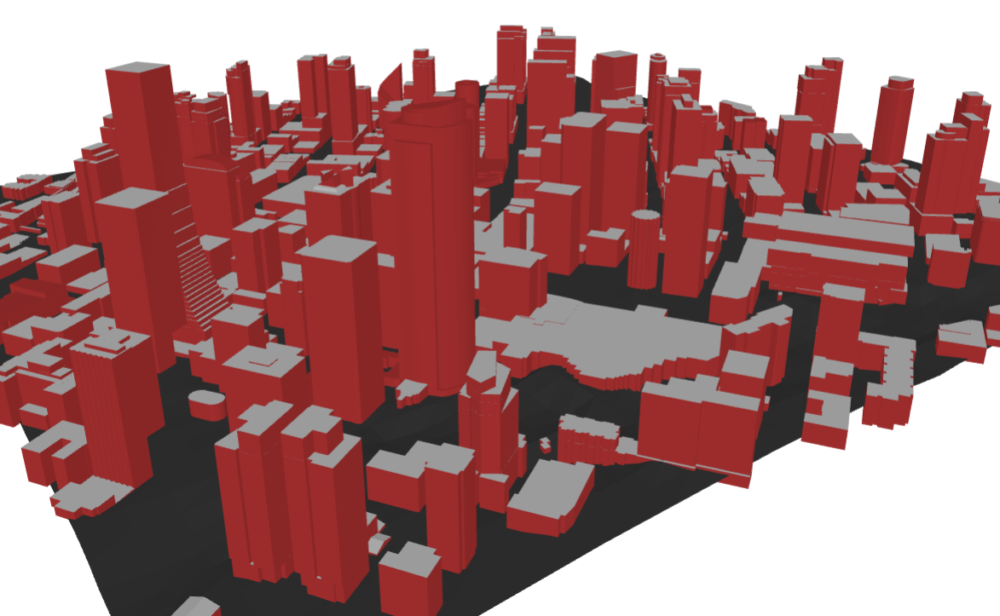
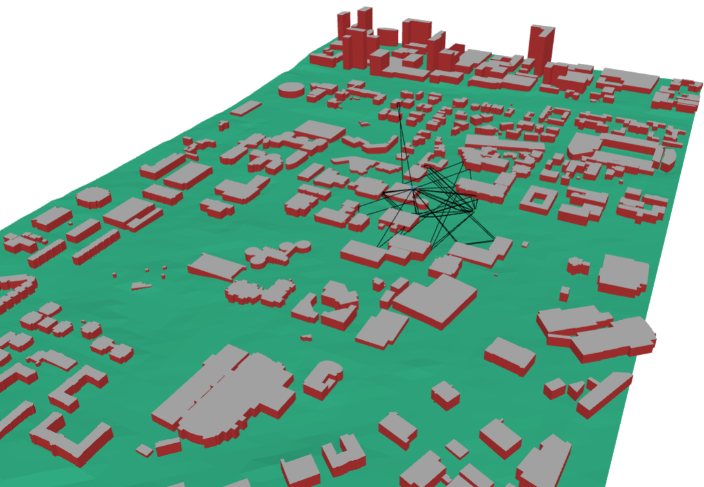
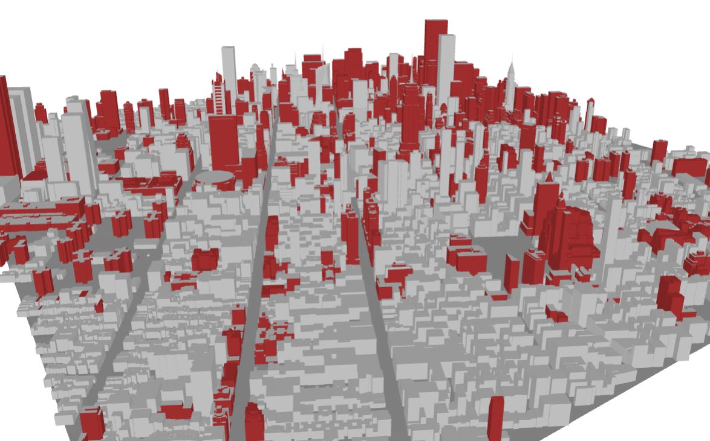

# OpenGERT: Open Source Automated Geometry Extraction with Geometric and Electromagnetic Sensitivity Analyses for Ray-Tracing Propagation Models

|  |  |  |
| :---: | :---: | :---: |
| **Seattle** | **Georgia Tech - Atlanta** | **Manhattan** |

*Seattle, Georgia Tech, and Manhattan represented in Sionna RT through automatic geometry extraction pipeline.*
