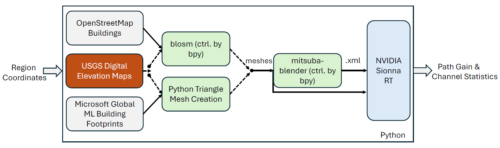
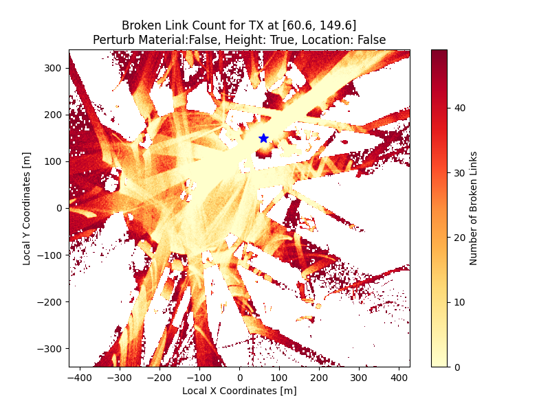
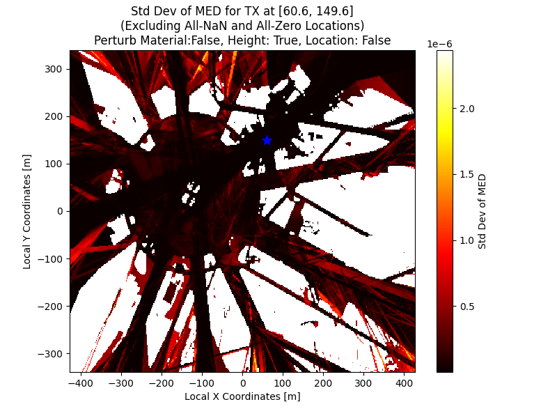
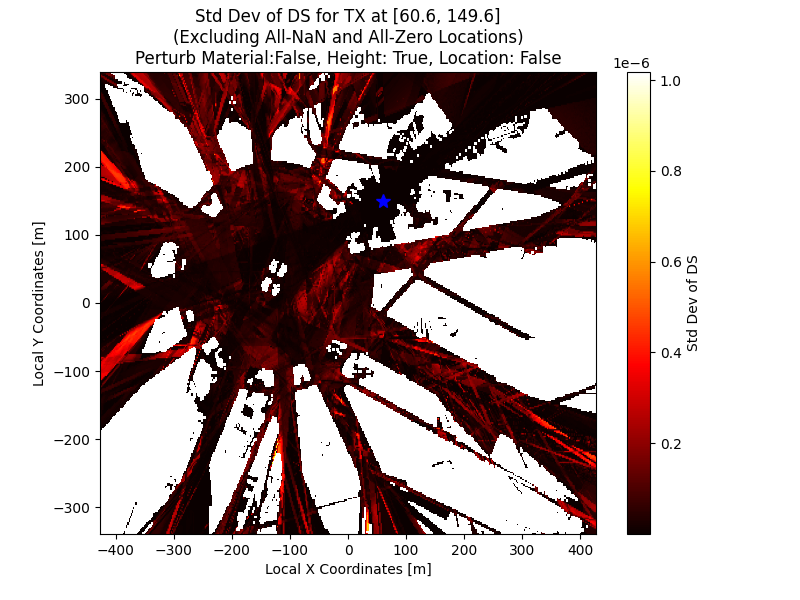

# OpenGERT: Open Source Automated Geometry Extraction with Geometric and Electromagnetic Sensitivity Analyses for Ray-Tracing Propagation Models

|  |  |  |
| :---: | :---: | :---: |
| **Seattle** | **Georgia Tech - Atlanta** | **Manhattan** |

*Seattle, Georgia Tech, and Manhattan represented in Sionna RT through automatic geometry extraction pipeline.*

## Workflow

## Sensitivity Analysis

  

    
    <figure style="width: 45%;">
      
      <figcaption><strong>Path Gain Standard Deviation, Height Perturbation, Etoile</strong></figcaption>
    </figure>
    
    <figure style="width: 45%;">
      
      <figcaption><strong>Link Outage Frequency, Height Perturbation, Etoile</strong></figcaption>
    </figure>
    
    <figure style="width: 45%;">
      
      <figcaption><strong>Mean Excess Delay Standard Deviation, Height Perturbation, Etoile</strong></figcaption>
    </figure>
    
    <figure style="width: 45%;">
      
      <figcaption><strong>Delay Spread Standard Deviation, Height Perturbation, Etoile</strong></figcaption>
    </figure>
  
  

  
<em>Analysis of Path Gain, Mean Excess Delay, and Delay Spread Standard Deviations and Link Outage Frequency with Height Perturbation in Etoile Scene</em>

## Credits