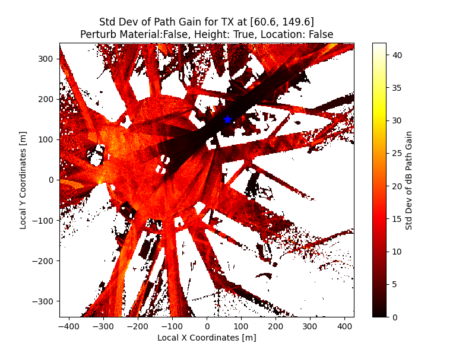

# OpenGERT: Open Source Automated Geometry Extraction with Geometric and Electromagnetic Sensitivity Analyses for Ray-Tracing Propagation Models

|  |  |  |
| :---: | :---: | :---: |
| **Seattle** | **Georgia Tech - Atlanta** | **Manhattan** |

*Seattle, Georgia Tech, and Manhattan represented in Sionna RT through automatic geometry extraction pipeline.*

## Workflow

## Sensitivity Analysis

Below are the detailed results of our sensitivity analysis conducted on the Etoile scene with height perturbations:

|  |  |
| :---: | :---: |
| **Path Gain Standard Deviation, Height Perturbation, Etoile** | **Link Outage Frequency, Height Perturbation, Etoile** |

|  |  |
| :---: | :---: |
| **Mean Excess Delay Standard Deviation, Height Perturbation, Etoile** | **Delay Spread Standard Deviation, Height Perturbation, Etoile** |

*Analysis of Path Gain, Mean Excess Delay, and Delay Spread Standard Deviations and Link Outage Frequency with Height Perturbation in Etoile Scene.*

## Credits